# Octopus Home Pro Software Development Kit (SDK)

## Introduction

Welcome to the Octopus Home Pro SDK guide. This wiki details the steps and recommendations for developing custom apps on your Home Pro. The Home Pro hosts a 40 pin Raspberry Pi HAT header for connecting Pi compatible sensors and HATs.

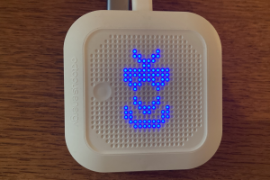

As the Home Pro has been released for early review, this guide is still a 'work in progress'. Eventually the user/developer will be able to download from an app store but until then a custom docker image will be downloaded automatically for users to log into, tinker around and develop apps.

To enable the SDK, once an internet connection is established, a docker image is downloaded to the device and a container is started which acts as a development workspace for users.

## Connecting to the Internet

To get access to the SDK running on the Home Pro you need to have your device connected to the WiFi network. This is done using the Octopus Energy R&D labs app

[iOS](https://apps.apple.com/gb/app/octopusenergy-r-d-labs/id1563402892)

[Android](https://play.google.com/store/apps/details?id=com.smartenergymobile&hl=en_US&pli=1)

Once device setup is successful, the app will list your Home Pro's local IP on the network which is needed later to connect to the SDK.
This IP address is referred to as \<HPRO-IP\> in the next sections of this document.

## SDK

Using the Home Pro's IP address from the previous section, make sure you are able to ping it
from a laptop/computer attached to the same local network, to prove connection

```
ping -c1 <HPRO-IP>
```

Power cycle the Home Pro. On first start after internet connectivity is established the device will download the SDK docker
image and start the container. This can take up to 5 minutes depending on the connection quality.

The status of the Home Pro SDK container is presented visually using 3 of the 4 LEDs that are
found on top of the front matrix display of the device. These statuses and their visual representation
is as follows:

- SDK docker image being downloaded: orange LED flashing


- SDK docker container not available after download: red LED solid


- SDK docker container exists but cannot start: red LED flashing


- SDK docker container is ready: green LED flashing


To verify access to the SDK container use secure shell (ssh). The following configuration can be used to ease out subsequent connections to the container.

````
Host hpro-sdk
  HostName <HPRO-IP>
  User root
  Port 8023
  HostKeyAlgorithms=+ssh-rsa
  PubkeyAcceptedAlgorithms=+ssh-rsa
````

The above settings shall be put in ssh configuration file of your host laptop/computer which, on Unix
hosts, is usually found at: `${HOME}/.ssh/config`.
Use one of your favorite text editors to create the configuration if it does not exist already. Then from
command line, run

````
ssh hpro-sdk
````

OR if you haven't created an ssh configuration as stated above, use the following command

```
ssh -p 8023 -o HostKeyAlgorithms=+ssh-rsa root@<HPRO-IP>
```

The default ssh password for root is 'cad_dev' which will get you into the SDK.

_**It is recommended to change your password**_. To do this from inside the container on the command line, type:

````
passwd
````

Supply the new password and confirm it.

_**NOTE:**_ The SDK image is downloaded from the below dockerhub address. You can develop new apps and submit a pull request to update
the image for the community if you wish.

https://hub.docker.com/repository/docker/rufilla/octhome-dev/general

## Connect with Visual Studio Code

To connect to the code base with VS Code follow these steps.

1. Click on the Extensions tab on the left panel.
2. Search for and install the 'remote-ssh'.

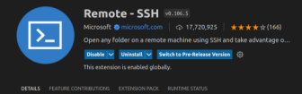

3. Choose View -> Command Palette -> Remote-SSH: Connect to Host
4. Select '+ Add New SSH Host' and add

```
ssh -p 8023 -o HostKeyAlgorithms=+ssh-rsa root@<HPRO-IP>
```

where \<HPRO-IP\> should be replaced with the IP address of your Home Pro retrieved in the
[Connecting to the Internet](#connecting-to-the-internet) section earlier in this guide.

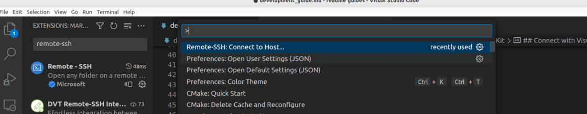

The first time an ssh connection is made to the Home Pro it will take a couple of minutes as the VSCode
SSH Server is downloaded to the Home Pro container for subsequent use.

When prompted use the password 'cad_dev' as before. 

The file system structure from root base directory is:

```
startup.sh
Octave_PWM/
Octave_I2C/
Octave_GPIO/
Octave_SPI/
```

The startup.sh is a script that is run at container launch while the Octave_* are directories for APIs of
the different interfaces. These are explained later.

##  40 Pin Header

To access the 40 pin header, turn over the Home Pro and remove the small cover at the back.

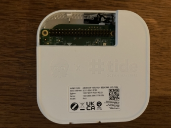

Here is the pinout of the header and the compatibility with a Raspberry Pi 4 header.

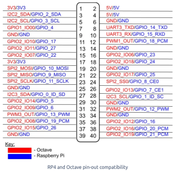

A convenient way to check and test apps is to use a header HAT such as the Grove HAT.

https://wiki.seeedstudio.com/Grove_Base_Hat_for_Raspberry_Pi/

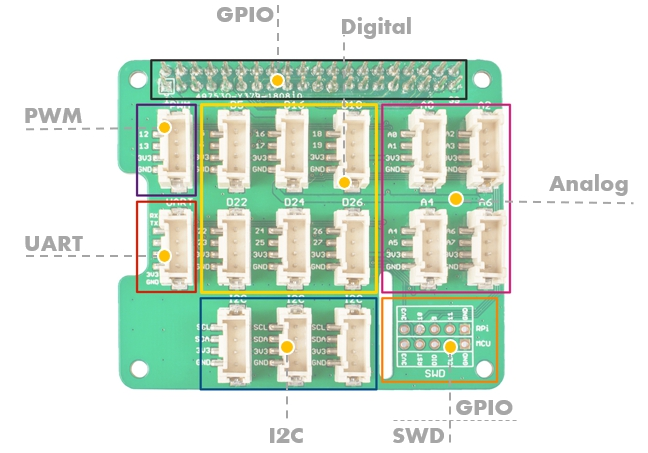

As a best practice, power off your Home Pro. Place the Grove HAT on the header as shown below
so pin 1 of the Home Pro matches the pin 1 of the Grove HAT (denoted by a square block of
solder on the pin where all others are round)

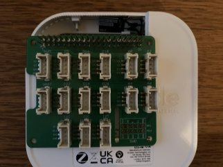

## 37 Sensor Kit

The 37 sensor kit was used to develop some basic apps and prove out connectivity and operation.

https://uk.robotshop.com/products/37-modules-sensor-kit-arduino-v2

Although intended for Arduino, the sensors can be connected easily to the Grove HAT for testing.

## Example Apps

The SDK comes with a few example apps that leverage the hardware interfaces exposed through the 40 pin header.

### Octave_GPIO

This directory inside the SDK container hosts files that access the general purpose digital inputs and outputs of the 40 pin header.

Octave_GPIO.py contains the class that controls access to the GPIO RESTful API. Call this class when access to a GPIO is required. 

flash-led.py is a simple python script that is called at start up and will be running constantly.

If an LED is placed across pin 5 and ground as shown below it will flash every second. This is a clear
indication that the docker container is running and SDK is accessible.
For reference, from the 4 pin jumper only 2 wires are needed.


To change and re-run the script, make sure to stop the invocation that runs at startup. The PID of this run can be found with

```
ps -ef | grep flash-led.py
```

you can then use the `kill` command with this PID. To run the example application again, use

```
cd /root/Octave_GPIO
python3 flash-led.py
```

This second/modified run can be stopped using the `Ctrl+C` key combination.
To stop the script from being run at SDK startup every time, edit the startup.sh file in base root directory. Use nano from a terminal based
ssh session or ideally the remote file explorer VSCode component for this.

**_Be careful editing the startup script as this also enables ssh connection, if corrupted it could
render the SDK container inaccessible. See the [Container Startup Script](#container-startup-script)
section for details before trying to edit._**

### Octave_I2C

This directory within the container has files that help access the I2C buses on the 40 pin header. There are 2 buses available.

The mpu6050_ctl.py example script communicates with the GY-521 module which is based on the MPU6050
sensor.

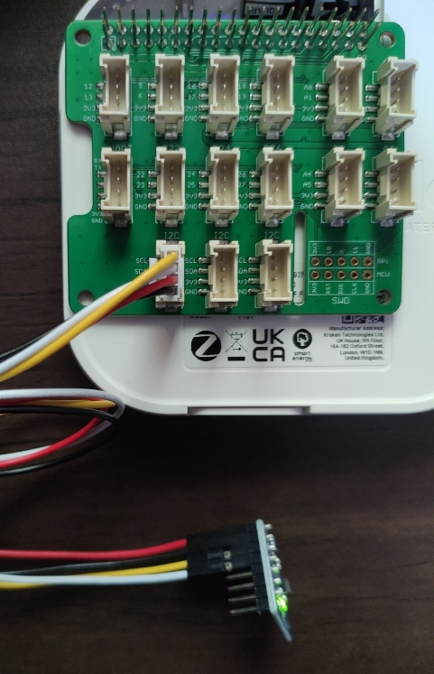

The example can be started as follows

```
cd /root/Octave_I2C
python3 mpu6050_ctl.py
```

Below is the readout of the module from the 37 sensor package that is connected on I2C bus 1 as depicted in the picture above.

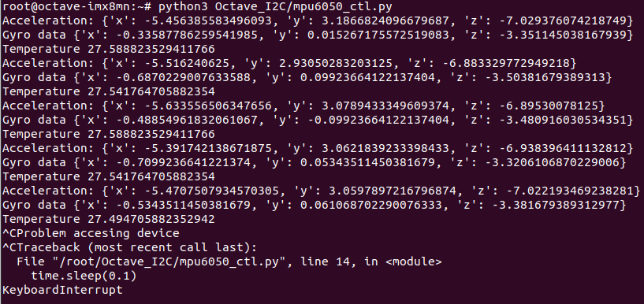

The example app keeps on reading the sensor unless stopped with a `Ctrl+C` key combination. The figure
below shows the I2C clock and data bus for the sensor on a picoscope.


The i2c-detect.py is a program that detects all i2c devices on a bus. This can also be achieved using
command line calls to the built in i2c utility.

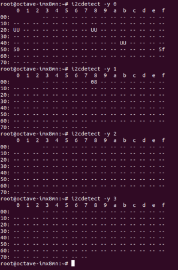

ds1037.py access a realtime clock. Although communication was valid, it was not fully functional at time
of initial release.

_**Note:**_ some devices require 5V to function properly. The Grove HAT only supplies 3V3. If the device
in use requires 5V then connect the device on the main Home Pro header and not on the Grove HAT
connectors. See pinout diagram in previous sections.

### Octave_PWM

This directory supplies example apps that access the PWM ports on the 40 pin header. Note the Grove
HAT only supports 1 PWM.

The file Octave_PWM.py is the class that controls access to the RESTful API that accesses the port.

The example script pwm.py drives the PWM output. Connect the passive buzzer from the sensor kit to bus 1 to hear the audio as shown below.

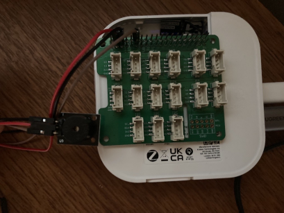

The speaker was attached on the main Home Pro header as it required 5V not 3V3. It was connected to pins
4, 6 and 12. See pinout in [40 Pin Header](#40-pin-header) section. The example application can be started
as follows

```
cd /root/Octave_PWM
python3 pwm.py
```

The image below shows the picoscope capture of the signal.

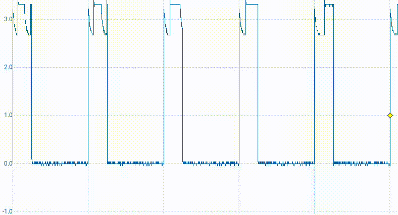

### Octave_SPI

The Octave_SPI directory contains an example application that scrolls a text
message on a SPI TFT LCD. For the purpose of this example a ST7735 based TFT
LCD was used. The hardware connections / pin mapping used between the Home Pro and the display for the example app are as follows:

| TFT Label | Pi Header Pin |
| -------   | ------------- |
| LED / BL  | 15            |
| SCK       | 23            |
| SDA       | 19            |
| A0 (DC)   | 11            |
| RST       | 13            |
| CS        | 24            |
| GND       | 39            |
| VCC       | 1             |

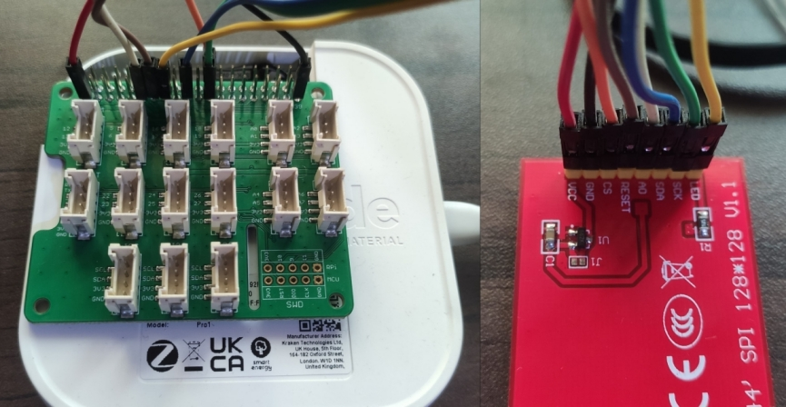

Once setup properly the demo can be launched as follows after ssh to the Home
Pro's docker SDK.

```
cd /root/Octave_SPI
python3 scrolling-text.py
```


## Container Startup Script

A user can edit the startup script (startup.sh) to change what is started at container launch. 

_**WARNING: Do not remove the start up of the sshd server else you will not be able to access the SDK on next boot.**_

If this does happen you will need to do a [factory reset](#factory-reset). This will download the original container again so any work you have done will be lost if not backed up earlier.
There is no set process for taking backups but tools like `scp` can be used to set this up.

## Factory Reset

To perform a factory reset locate the pin hole that is between the USB ports and the white WPS button.

While the board is powered on, press and hold for **more than 10 seconds**. This will remove the SDK container and additionally wipe the wifi configuration so the steps for connecting to the internet will have to be carried out again.

A 'press and hold' for less than 10 seconds will wipe the wifi configuration only.

The SDK docker image will be re-downloaded and started automatically once internet connectivity is established.